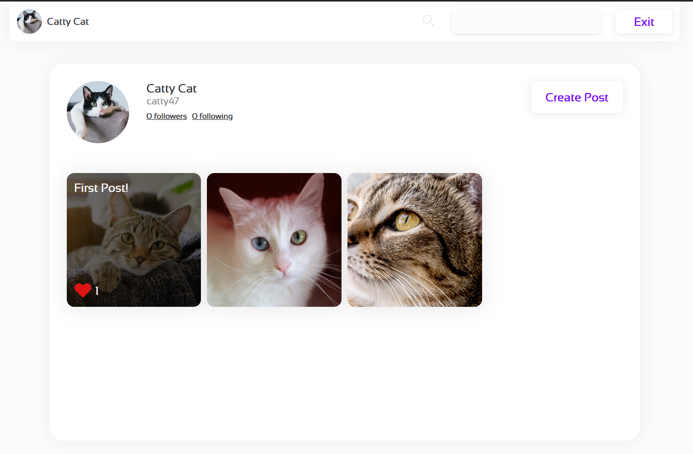
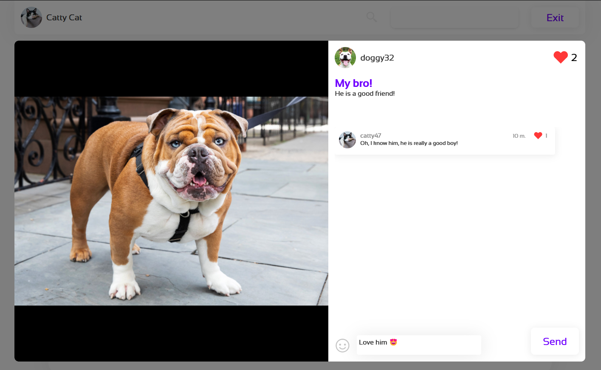

***Instagram-lite-copy***
 
 
**About Project**:  
Hello world! It\`s my first MERN project. The main task was to create a simple copy of famous social network - Instagram. To be honest I am an absolutely zero in AI (my bad), so  you won\`t see anything about "heavy alghoritms" in this repo. But if you\`re a beginner in webdev, I\`m sure, this will be useful for you!
  >A few words about contributor - [Alexander](https://github.com/energy-spectrum) his opportunity is to improove the server with using Go and PostgreSQL.
  
:gear: **Stack** :gear::     
  - *Client* :
    - React typescript
    - Redux toolkit
    - React-router-dom
    - Axios
  - *Server*:
    - Go, Gin
    - PostgreSQL
    - WebSocket Gorrila
    - Swagger documentation
    - sqlc
    - Protobuf
    
:heavy_check_mark: **What is done** :heavy_check_mark::
  - Auth (Login and Registration) through jwt and auto-enter at coming back
  - Profile page (opportunities to find users by search bar, follow user and watch his followers and follows)
  - Posts (opportunities to create or delete post, like other posts and send comments)
  - Comments (oportunities to create, delete, like)
  - Chat on server side
  - Swagger documentation
  - Adaptive design

:zap: **In progress** :zap:: 
  - Chat

:bulb: **What planned** :bulb::
  - Deploy beta version
  - Dark theme
  - i18n  
  - Newsline

:blue_book: **Commits names meanings** :blue_book::
  - **\*ADD\*** - Adding new features
  - **\*REFACTOR\*** - Refactoring (correction of architecture, names, etc.)
  - **\*BUGFIX\*** - Bugfixes
  - **\*TEST\*** - Adding tests
  - **\*GRAND\*** - Major update 
  - **\*ADAPTIVE\*** - Solving adaptive design issues 
  - **\*OPTIMIZE\*** - Improving the performance, efficiency, or scalability of the code
  - **\*PROTO\*** - Proto
  - **\*SWAGGER\*** - Swagger

**Profile**

**Post**

